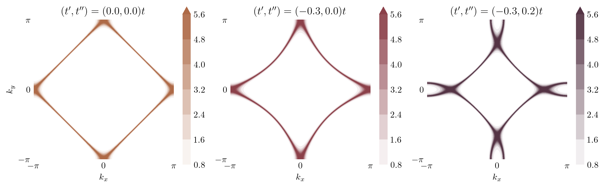

<h1 align="center">NQFT (Numerical Quantum Field Theory)</h1>

<div align="center">
  
  <br />
  <figcaption>Fig.1 - Spectral functions in the Brillouin zone (2D)</figcaption>
</div>

<br />

<div align="center">
  This repository presents my journey through numerical methods in the context of materials endowed with strongly correlated electrons. There are various many-body numerical methods and some of them such as (CDMFT, VMC, etc.) will be introduced in this project.
</div>

<br />

<div align="center">
  
  <a href=""></a>
  <a href=""></a>
  
</div>

## Table of contents

- [Requirements](#requirements)
  - [Poetry (optionnal)](#poetry-optionnal)
  - [pyqcm](#pyqcm)

## Requirements

### Poetry (optionnal)

In order to use this repository swimmingly, Python package manager [Poetry](https://python-poetry.org/) is recommended. It provides a easy dependencies managing for Python projects and gives user the ability of updating packages, build the project and even publish it on [PyPI](https://pypi.org/). Users having Unix based OS can install it via

```shell
curl -sSL https://install.python-poetry.org | python3 -
```

that obviously depends on Python3. Then, to create/sync your current environnement with the project dependencies using `pyproject.toml` and `poery.lock` files, you can simply use

```shell
poetry install
```

and [Poetry](https://python-poetry.org/) will automatically create a Python virtual environnement including all[^1] the packages needed for the project to be functionnal.

[^1]: Except here for one library named [pyqcm](https://github.com/dsenech/qcm_wed/tree/master). It needs a specific installation because it isn't published on PyPI yet so [Poetry](https://python-poetry.org/) isn't able to access it via global `pip install`.

### pyqcm

> [pyqcm](https://github.com/dsenech/qcm_wed/tree/master) is a python module that interfaces with a library written in C++: qcm. This library provide a collection of functions that help implement quantum cluster methods. Specifically, it provides an exact diagonalization solver for small clusters on which a [Hubbard-like model](https://en.wikipedia.org/wiki/Hubbard_model) is defined and provides functions to define infinite-lattice models and to embed the clusters into the lattice via Cluster Pertrubation Theory ([CPT](https://arxiv.org/abs/cond-mat/0205044)). Methods like the Variational Cluster Approximation (VCA) and Cluster Dynamical Mean Field Theory (CDMFT) are then implemented from qcm by the pyqcm module, which is written in Python only.
>
> - <cite> David Sénéchal </cite>

This library is the numeric and algorithmic core of this repository. It has been written by the unswerving hands of [David Sénéchal](https://www.physique.usherbrooke.ca/pages/senechal), teacher at Université de Sherbrooke since 1992.
